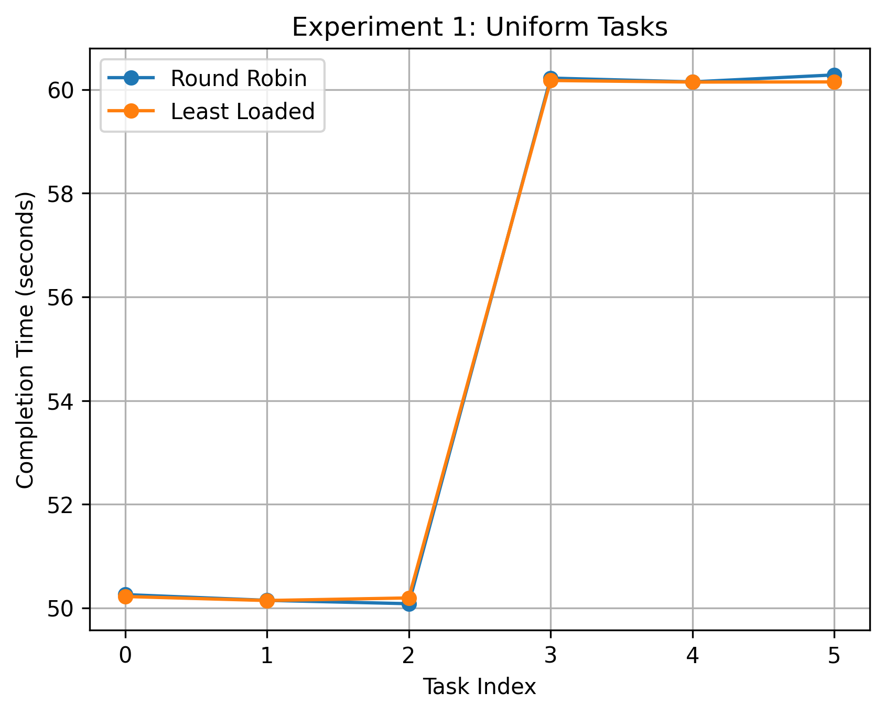
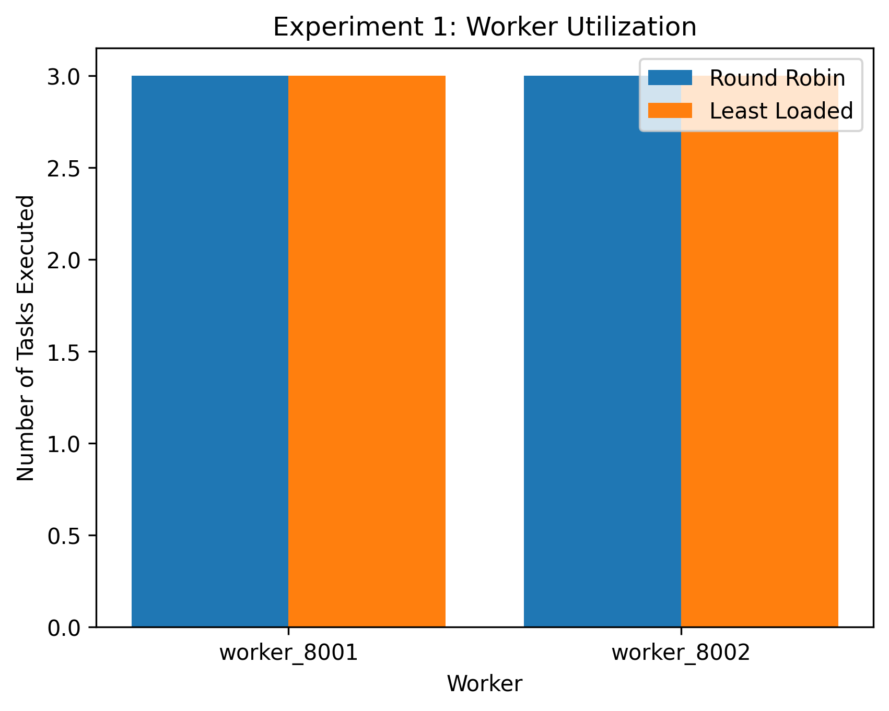
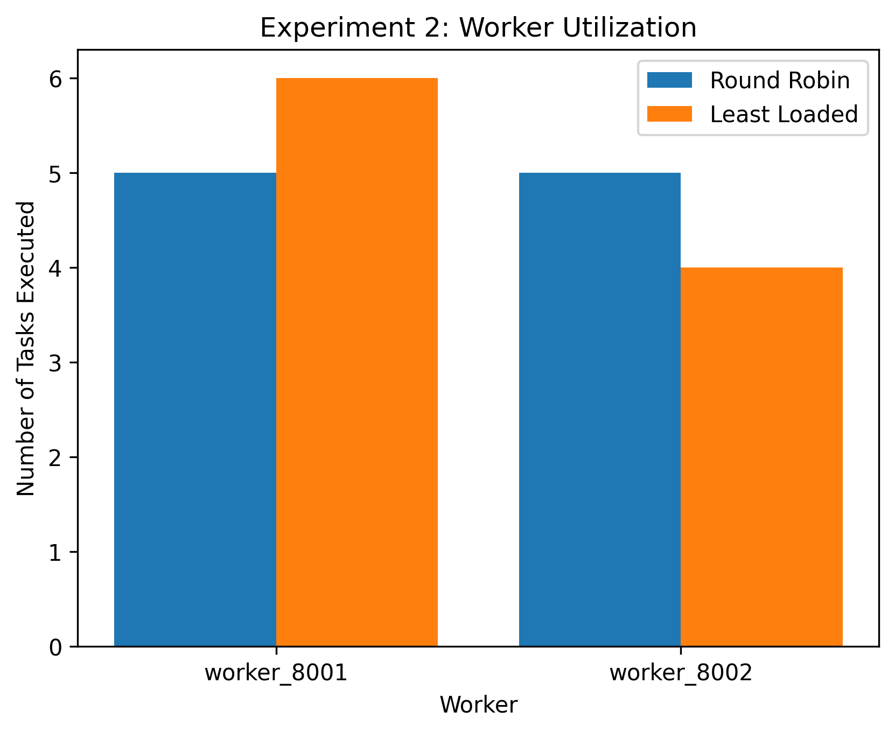

# Performance Evaluation of a Fault-Tolerant Distributed Task Scheduling System
This repo contains a fault-tolerant distributed task scheduling system with heartbeat-based failure detection, dynamic task reassignment, Round-Robin and Least-Loaded scheduling policies, and experimental performance evaluation.
## 📌 Overview

A fault-tolerant distributed task scheduling system implemented in Python using FastAPI.  
The project simulates a distributed computing environment in which a central scheduler assigns tasks to multiple worker nodes via HTTP communication.

The system demonstrates core distributed-systems principles including:

- Service decoupling  
- Network-based coordination  
- Failure detection  
- Automatic recovery  
- Scheduling strategy evaluation  

The project is designed for educational, research, and experimentation purposes in distributed systems and cloud computing.

## 🏗 System Architecture

The system follows a **Scheduler–Worker distributed model**.

### 🔹 Scheduler

Responsible for:

- Registering workers dynamically  
- Assigning tasks using scheduling policies  
- Monitoring worker health via heartbeats  
- Detecting worker failure  
- Reassigning unfinished tasks automatically  
- Tracking task performance metrics  

### 🔹 Workers

Responsible for:

- Receiving tasks from the scheduler  
- Executing tasks independently  
- Sending periodic heartbeat signals  
- Reporting task completion  

### 🔹 Communication Model

All components communicate using **REST APIs over HTTP**, meaning:

- No shared memory  
- No shared variables  
- All coordination happens through network calls


## ⚙️ Core Features

The system implements several core mechanisms commonly found in real distributed platforms:

### ✅ Distributed Task Execution
Tasks are executed across multiple worker services running as independent processes.

### ✅ Dynamic Worker Registration
Workers automatically register with the scheduler at startup, allowing flexible scaling of the system.

### ✅ Heartbeat-Based Failure Detection
Workers periodically send heartbeat signals to indicate liveness.  
If heartbeats stop, the scheduler marks the worker as failed.

### ✅ Automatic Task Reassignment
If a worker fails while executing a task, the scheduler automatically reassigns unfinished work to another available worker.

### ✅ Scheduling Policies
Two task allocation strategies are implemented:

- **Round-Robin Scheduling** — tasks are assigned sequentially to workers
- **Least-Loaded Scheduling** — tasks are assigned to the worker with the lowest current load

These strategies allow experimentation with different scheduling behaviors.

### ✅ System Monitoring Interface
A status API exposes real-time information about workers, task states, and system load, enabling inspection and debugging.


This interaction pattern mirrors real-world microservice-based distributed systems.

## 🧪 Experimental Evaluation

To study the behavior of the scheduling system, a series of controlled experiments were conducted comparing the Round-Robin and Least-Loaded policies.

Experiments were designed to evaluate how scheduling decisions influence system performance under different workload characteristics. Two types of task distributions were tested:

- **Uniform workload experiments**, where task durations were similar
- **Heterogeneous workload experiments**, where task durations varied significantly

For each experiment, the system recorded task completion times, worker utilization, and overall execution performance. These measurements were used to generate visualizations and analyze how effectively each scheduling policy distributed work across available workers.

The evaluation focuses on three primary metrics:

- **Task completion time**, indicating how long individual tasks require to finish
- **Worker utilization**, showing how tasks are distributed across nodes
- **Makespan**, representing the total time required for all tasks to complete

The following subsections present the experimental results along with visualizations and interpretations.


---

## 📊 Experimental Results

### Experiment 1 — Uniform Workload

In this experiment, tasks had similar durations to observe how scheduling behaves under balanced workloads.



Both policies produced **similar completion times**, indicating that scheduling choice has limited impact when workload distribution is uniform.

---

### Experiment 2 — Mixed Workload

This experiment used tasks with varied durations to evaluate how scheduling policies respond to heterogeneous workloads.


Results show that scheduling decisions influence task timing and worker utilization when workloads are uneven.

---

### Worker Utilization

The following charts illustrate how tasks were distributed across workers.




These graphs show how load balancing differs between scheduling strategies.

---

### Makespan Comparison

The total completion time for each experiment is shown below.


Makespan reflects the overall system efficiency and highlights the impact of scheduling decisions on total execution time.


## ▶️ Running the System

The system consists of one scheduler service and one or more worker services.  
Each component runs as an independent FastAPI application.

### 1️⃣ Start the Scheduler

```bash
uvicorn scheduler:app --port 8000
```

The scheduler exposes APIs for worker registration, task submission, system monitoring, and experiment results.

### 2️⃣ Start Worker Services

Run each worker in a separate terminal window.

Example:
```bash
uvicorn worker:app --port 8001
```
```bash
uvicorn worker2:app --port 8002
```

When started, workers automatically register themselves with the scheduler and begin sending heartbeat signals.

### 3️⃣ Submit Tasks

Open the interactive API documentation:
```bash
http://127.0.0.1:8000/docs
```

Use the /submit_task endpoint to create tasks.

Example request:
```bash
{
  "task_id": 1,
  "duration": 20
}
```

### 4️⃣ Monitor System State

The current system status can be inspected at:
```bash
http://127.0.0.1:8000/status
```

This endpoint displays active workers, task assignments, system load, and heartbeat information.

### 5️⃣ Retrieve Experiment Results

After tasks complete, performance data can be obtained from:
```bash
http://127.0.0.1:8000/experiment_results
```

The returned JSON can be saved for visualization and analysis.
Save JSON outputs into experiments/.
### Then generate plots:
```bash
python compare_results.py
```

Graphs will be saved in the plots/ folder.

## 📂 Repository Structure

The repository is organized to separate system components, experimental data, and generated visualizations.

```bash

scheduler.py                # Central scheduler service
worker.py                   # Worker implementation
worker2.py                  # Second worker instance for multi-node testing
compare_results.py          # Script for generating experiment visualizations

experiments/                # Saved experiment outputs (JSON format)
    results_round_robin.json
    results_least_loaded.json
    results_round_robin_experiment2.json
    exp2_result_least_loaded_.json

plots/                      # Generated graphs and performance visualizations
    *.png

requirements.txt            # Project dependencies
README.md                   # Project documentation

```

## 🎓 Educational Value

This project demonstrates key concepts from distributed systems and cloud computing, including service coordination, failure detection, task scheduling, and performance evaluation.

It can be used as a practical reference for:

- Distributed systems coursework  
- Fault-tolerant system design demonstrations  
- Scheduling algorithm comparison studies  
- Microservices coordination experiments  
- Graduate-level systems project portfolios  

The implementation combines both engineering design and empirical evaluation, making it suitable for academic learning as well as research-oriented exploration.

## 🔮 Future Improvements

Possible extensions of the system include:

- Priority-based or deadline-aware scheduling policies  
- Persistent task queues and state storage  
- Containerized deployment using Docker  
- Distributed logging and monitoring dashboards  
- Automatic worker scaling mechanisms  
- Deployment across multiple physical or cloud machines  

These additions would further align the system with production-scale distributed platforms.


